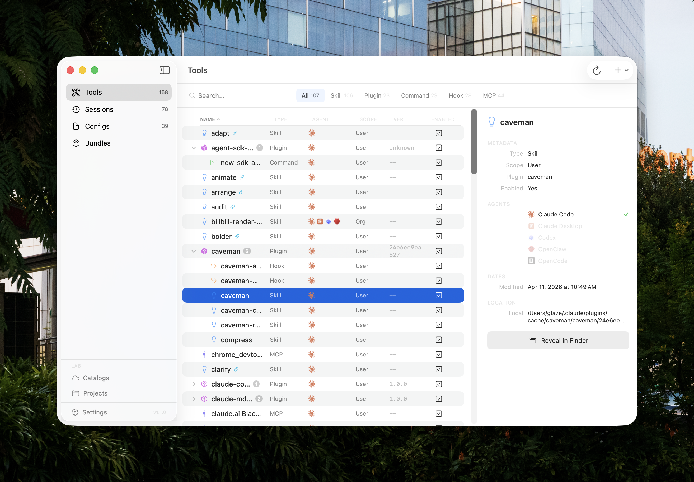
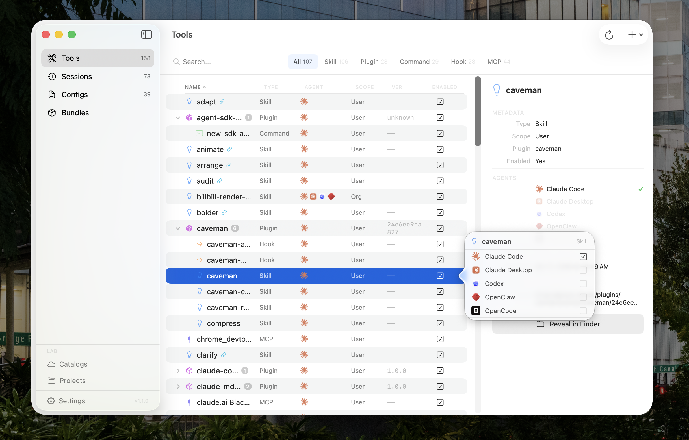
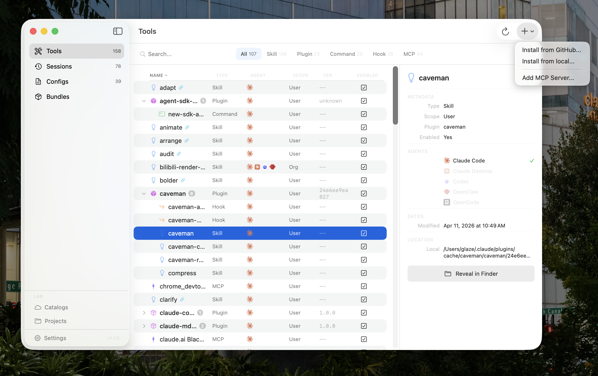
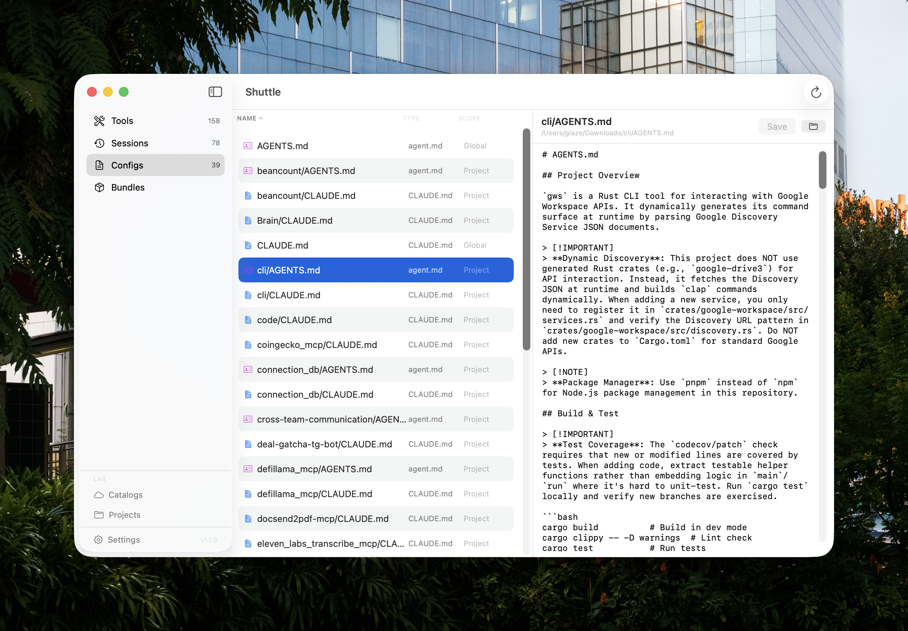
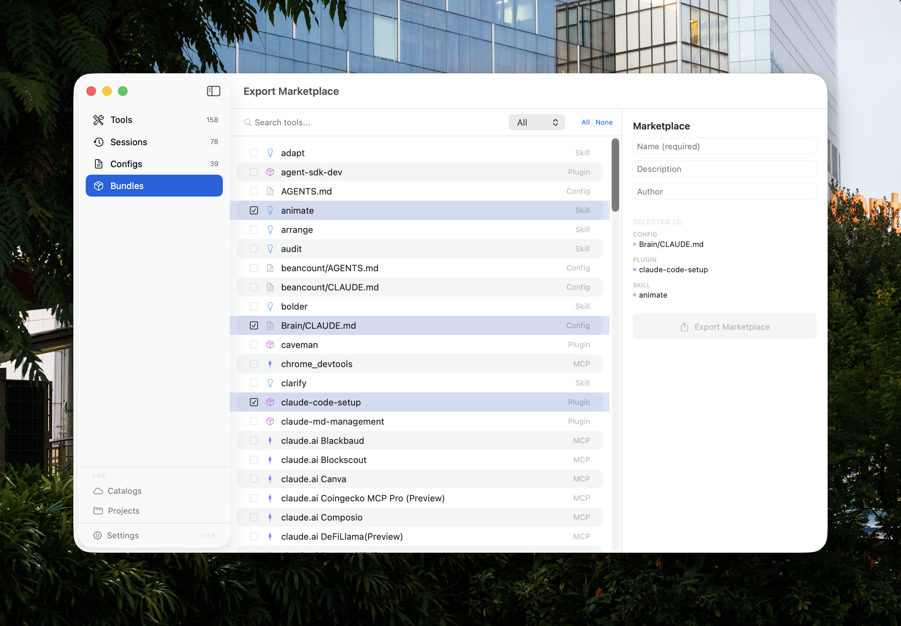
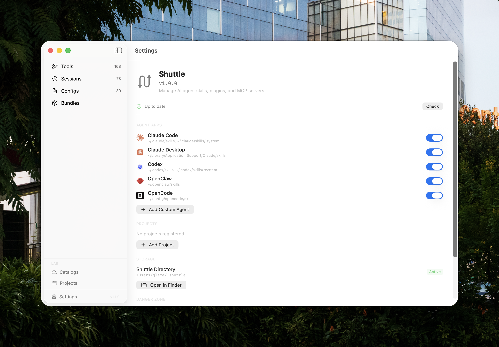

# Shuttle

A native macOS app + CLI for managing AI agent skills, plugins, MCP servers, configs, and sessions across multiple AI coding agents.

**One app to manage them all** — Claude Code, Claude Desktop, Codex, OpenClaw, and OpenCode.



## Download

Download the latest release from the [Releases](https://github.com/glazec/shuttle-releases/releases) page.

| Asset | Description |
|---|---|
| `Shuttle-app-v*.zip` | macOS app (14.0+) |
| `shuttle-cli-darwin-arm64` | CLI binary (Apple Silicon) |

### Install the App
1. Download `Shuttle-app-v*.zip` from Releases
2. Unzip and drag `Shuttle.app` to `/Applications`
3. Open the app (since the app is not signed, macOS will block it on first launch)

**Option A — Terminal (fastest)**
```bash
xattr -d com.apple.quarantine /Applications/Shuttle.app
```
Then open Shuttle normally.

**Option B — System Settings**
1. Double-click `Shuttle.app` — macOS shows a warning, click Cancel
2. Go to **System Settings → Privacy & Security → Security**
3. You will see a one-time **"Open Anyway"** button for Shuttle.app — click it
4. Confirm in the dialog that appears

**Option C — Right-click**
1. Right-click (or Control-click) `Shuttle.app`
2. Select **Open** from the context menu
3. Click **Open** in the dialog

### Install the CLI
```bash
curl -L https://github.com/glazec/shuttle-releases/releases/latest/download/shuttle-cli-darwin-arm64 -o /usr/local/bin/shuttle
chmod +x /usr/local/bin/shuttle
shuttle --help
```

### Auto-Update
- **App**: Shuttle menu, Check for Updates (Cmd+Shift+U), or Settings, Check
- **CLI**: `shuttle self-update`

## Features

### Unified Tools Table
All your skills, plugins, commands, hooks, and MCP servers in one sortable, filterable view. Type tabs let you focus on Skills, Plugins, Commands, Hooks, or MCP individually.



### Per-Agent Enable/Disable
Click the checkbox on any tool to install or remove it from any agent. Shuttle uses symlinks so there is one source of truth and no version drift.

### Inspector Panel
Click any tool to see full metadata: type, scope, plugin, version, agent presence, dates, file location, and action buttons (Reveal in Finder, Delete).

### Import from Anywhere
Install tools from GitHub repos, local folders, or .zip files. Shuttle auto-detects whether it is a skill, plugin, or marketplace.



### Git-Tracked Installs
Skills installed from GitHub repos use git sparse-checkout. They keep full git tracking. Update with `git pull`, edit locally, and Shuttle detects newer upstream versions.

### Organization Skills and Remote MCP
Shuttle auto-discovers org-level skills (via `claude -p`) and remote MCP servers (via `claude mcp list`). These appear alongside local tools with all supported agent icons.

### Config Editor
View and edit CLAUDE.md, AGENTS.md, and agent.md files across all your projects. Syntax-highlighted editor with unsaved changes protection.



### Sessions Browser
Browse sessions across all agents. Codex sessions with nested date directories are fully supported.


### Bundle Export
Select any combination of skills, plugins, MCP servers, and configs to export as a Claude marketplace-compatible package.



### Settings
Manage agent apps (toggle, add custom), register projects, check for updates, and configure storage.



## Supported Agents

| Agent | Skills | MCP Config | Sessions |
|---|---|---|---|
| Claude Code | `~/.claude/skills` | `~/.claude.json` | `~/.claude/sessions/` |
| Claude Desktop | `~/Library/.../Claude/skills` | `.../claude_desktop_config.json` | `.../claude-code-sessions/` |
| Codex | `~/.codex/skills` | (per-plugin .mcp.json) | `~/.codex/sessions/YYYY/MM/DD/` |
| OpenClaw | `~/.openclaw/skills` | (none) | `~/.openclaw/sessions/` |
| OpenCode | `~/.config/opencode/skills` | `~/.config/opencode/opencode.json` | `~/.local/state/opencode/` |

Custom agents can be added in Settings with configurable paths and colors.

## Enable/Disable Logic

Shuttle uses symlinks to share tools between agents. One source of truth, no copies that drift apart.

### Skills (standalone)

| Action | What happens |
|---|---|
| **Enable for another agent** | Import to `~/.shuttle/skills/`, create symlink from agent dir to store |
| **Disable (symlink)** | Remove symlink. Store copy untouched |
| **Disable (real copy, others exist)** | Import to store first, then remove the real copy |
| **Disable (only copy)** | Confirmation dialog before permanent delete |
| **Delete from all** | Remove all symlinks + store copy |

### Plugin child skills

| Action | What happens |
|---|---|
| **Enable for another agent** | Symlink from plugin cache dir to agent skill dir |
| **Disable** | Remove symlink only. Plugin source untouched |
| **Delete** | Not available. Skill belongs to the plugin package |

### MCP servers

| Action | What happens |
|---|---|
| **Enable for agent** | Copy full config entry to agent config file |
| **Disable from agent** | Remove entry from agent config file |
| **Agent without MCP support** | Row dimmed, "Not supported". Use Copy MCP Config for manual paste |
| **Remove from all** | Remove from every agent config file |

## Edge Cases

| Scenario | How Shuttle Handles It |
|---|---|
| Same skill in multiple agents | Merged into one row with agent presence icons |
| Version conflict (symlink vs real copy) | Yellow warning triangle. Inspector shows Version Conflict with Update Store / Relink actions |
| Org skills (API-served, no files) | Auto-detected via Claude CLI. Read-only. Shown across all supported agents |
| Remote MCP servers (claude.ai) | Auto-detected via `claude mcp list`. Shown with connection status |
| Zip with nested subdirectory | Auto-descends into single subdir after extraction |
| Duplicate import | Per-item overwrite/skip choice, shown only when conflicts exist |
| Import from GitHub | Git sparse-checkout preserves tracking. One clone per repo, symlinks per skill |
| Atomic installs | Downloads to temp dir first, swaps only after successful download |
| Path traversal | All slugs validated. Symlink targets checked against safe roots |
| Unsaved config changes | Unsaved Changes dialog prevents accidental loss on tab switch |
| Uninstall Shuttle | Replaces all symlinks with real copies, removes ~/.shuttle/, clears settings |

## Requirements

- macOS 14.0 (Sonoma) or later
- Apple Silicon (arm64)

## Author

Glaze — [i@inevitable.tech](mailto:i@inevitable.tech)
